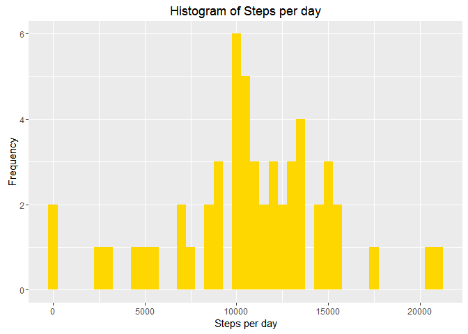
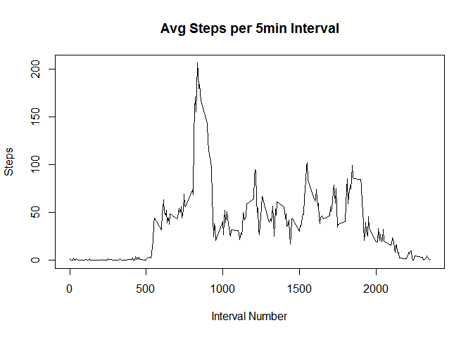
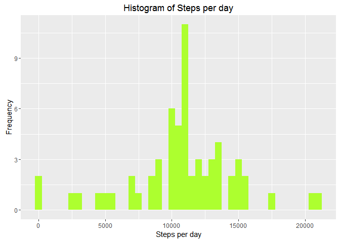
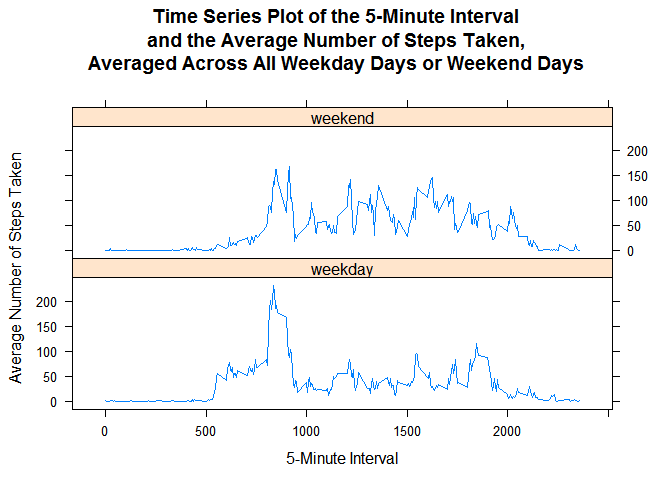

# Reproducible Research: Peer Assessment 1
This assignment makes use of data from a personal activity monitoring device. This device collects data at 5 minute intervals through out the day. The data consists of two months of data from an anonymous individual collected during the months of October and November, 2012 and include the number of steps taken in 5 minute intervals each day.


Load libraries, set echo

```r
library(lubridate)
```

```
## Warning: package 'lubridate' was built under R version 3.2.3
```

```r
library(ggplot2)
```

```
## Warning: package 'ggplot2' was built under R version 3.2.3
```

```r
library(knitr)
```

```
## Warning: package 'knitr' was built under R version 3.2.4
```

```r
library(dplyr)
```

```
## Warning: package 'dplyr' was built under R version 3.2.3
```

```
## 
## Attaching package: 'dplyr'
```

```
## The following objects are masked from 'package:lubridate':
## 
##     intersect, setdiff, union
```

```
## The following objects are masked from 'package:stats':
## 
##     filter, lag
```

```
## The following objects are masked from 'package:base':
## 
##     intersect, setdiff, setequal, union
```

```r
opts_chunk$set(echo = TRUE)
```

Load the data  
(NOTE: It is assumed that the data file "activity.csv" has been downloaded, unzipped, and and saved in the working directory.)

```r
activity <- read.csv("activity.csv")
```

Convert date format

```r
activity$date <- ymd(activity$date)
```

Check data, confirm date format

```r
str(activity)
```

```
## 'data.frame':	17568 obs. of  3 variables:
##  $ steps   : int  NA NA NA NA NA NA NA NA NA NA ...
##  $ date    : POSIXct, format: "2012-10-01" "2012-10-01" ...
##  $ interval: int  0 5 10 15 20 25 30 35 40 45 ...
```

**What is mean total number of steps taken per day?**  
Calculate:

```r
stepdata <- aggregate(steps ~ date, data=activity, sum, na.rm = TRUE)
```

**Make a histogram of the total number of steps taken each day**

```r
ggplot(stepdata, aes(stepdata$steps)) +
  geom_histogram(fill = "gold", binwidth = 500) +
  labs(title = "Histogram of Steps per day", x = "Steps per day", y = "Frequency")
```



**Calculate and report the mean and median total number of steps taken per day**

```r
mean_steps <- mean(stepdata$steps, na.rm = TRUE)
median_steps <- median(stepdata$steps, na.rm = TRUE)
cat("Mean steps per day:", mean_steps)
```

```
## Mean steps per day: 10766.19
```

```r
cat("Median steps per day:", median_steps)
```

```
## Median steps per day: 10765
```


##What is the average daily activity pattern?

**1. Make a time series plot (i.e. type = "l") of the 5-minute interval (x-axis) and the average number of steps taken, averaged across all days (y-axis)**

```r
dailypattern <- aggregate(steps ~ interval, data=activity, mean, na.rm=TRUE)
plot(dailypattern$interval, dailypattern$steps, type = "l", main = "Avg Steps per 5min Interval", xlab="Interval Number", ylab = "Steps")
```



**2. Which 5-minute interval, on average across all the days in the dataset, contains the maximum number of steps?**

```r
maxsteps <- max(dailypattern$steps)
dailypattern[which.max(dailypattern$steps), ]
```

```
##     interval    steps
## 104      835 206.1698
```

##Imputing missing values
Note that there are a number of days/intervals where there are missing values (coded as NA). The presence of missing days may introduce bias into some calculations or summaries of the data.

**1. Calculate and report the total number of missing values in the dataset (i.e. the total number of rows with NAs)**

```r
sum(is.na(activity$steps))
```

```
## [1] 2304
```

**2. Devise a strategy for filling in all of the missing values in the dataset.** 
The strategy does not need to be sophisticated. For example, you could use the mean/median for that day, or the mean for that 5-minute interval, etc.  

        

I use the mean for the 5-minute interval (from "dailypattern") to fill in the missing values. 

```r
filled_data <- activity
filled_data$steps[is.na(filled_data$steps)] <- dailypattern$steps
```

**3. Create a new dataset that is equal to the original dataset but with the missing data filled in.**

The new version, "filled_data", should have all the missing data filled in. We can check by counting the number of missing values, as we did above, with the original dataset. 

```r
sum(is.na(filled_data$steps))
```

```
## [1] 0
```


**4. Make a histogram of the total number of steps taken each day and Calculate and report the mean and median total number of steps taken per day. Do these values differ from the estimates from the first part of the assignment? What is the impact of imputing missing data on the estimates of the total daily number of steps?**

```r
newstepdata <- aggregate(steps ~ date, data=filled_data, sum, na.rm = TRUE)
```

**Make a histogram of the total number of steps taken each day**

```r
ggplot(newstepdata, aes(newstepdata$steps)) +
  geom_histogram(fill = "greenyellow", binwidth = 500) +
  labs(title = "Histogram of Steps per day", x = "Steps per day", y = "Frequency")
```



**Calculate and report the mean and median total number of steps taken per day**

```r
newmean_steps <- mean(newstepdata$steps, na.rm = TRUE)
newmedian_steps <- median(newstepdata$steps, na.rm = TRUE)
cat("Mean steps per day:", mean_steps)
```

```
## Mean steps per day: 10766.19
```

```r
cat("Median steps per day:", median_steps)
```

```
## Median steps per day: 10765
```
Using this method to impute missing values, the mean and median steps per day do not differ.


##Are there differences in activity patterns between weekdays and weekends?

For this part the weekdays() function may be of some help here. Use the dataset with the filled-in missing values for this part.

**1. Create a new factor variable in the dataset with two levels -- "weekday" and "weekend" indicating whether a given date is a weekday or weekend day.**

```r
filled_data$dayofweek <- weekdays(filled_data$date)
filled_data$partofweek <- as.factor(ifelse(filled_data$dayofweek == "Saturday" | filled_data$dayofweek == "Sunday", "weekend", "weekday"))
```

**2. Make a panel plot containing a time series plot (i.e. type = "l") of the 5-minute interval (x-axis) and the average number of steps taken, averaged across all weekday days or weekend days (y-axis).** 

```r
newdailypattern <- aggregate(steps ~ interval + partofweek, filled_data, mean)
library(lattice)
xyplot(
		steps ~ interval | partofweek,
        newdailypattern,
        type = "l",
        layout = c(1,2),
        main = "Time Series Plot of the 5-Minute Interval\nand the Average Number of Steps Taken,\nAveraged Across All Weekday Days or Weekend Days",
        xlab = "5-Minute Interval",
        ylab = "Average Number of Steps Taken"
)	
```




